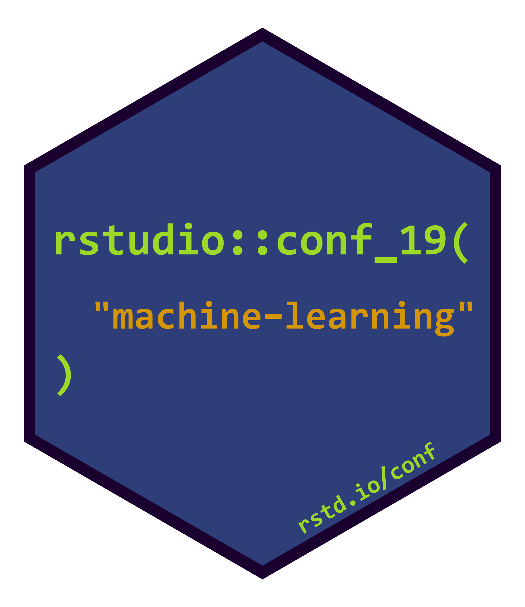

<!-- README.md is generated from README.Rmd. Please edit that file -->

```{r, include = FALSE}
knitr::opts_chunk$set(
  collapse = TRUE,
  comment = "#>"
)
```
# rstudioconf19-machine-learning  

<!-- badges: start -->
[](https://travis-ci.org/mkearney/rstudioconf19-machine-learning)
[](https://codecov.io/gh/mkearney/rstudioconf19-machine-learning?branch=master)
[](https://www.tidyverse.org/lifecycle/#experimental)
<!-- badges: end -->

## Resources

+ Workshop repo: [topepo/rstudio-conf-2019](https://github.com/topepo/rstudio-conf-2019)

## Notes
